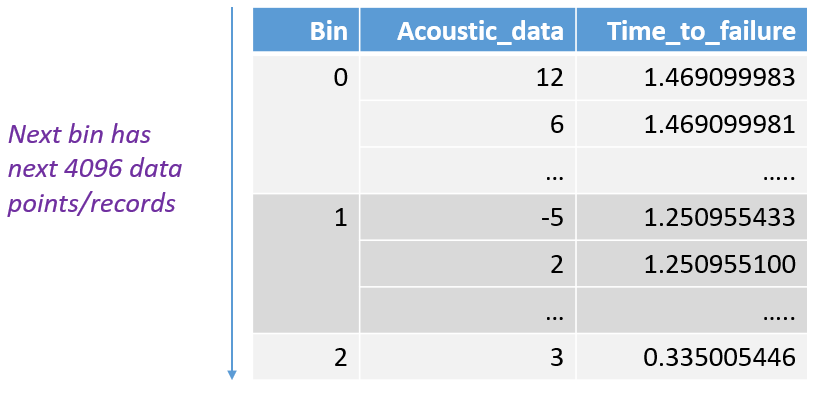
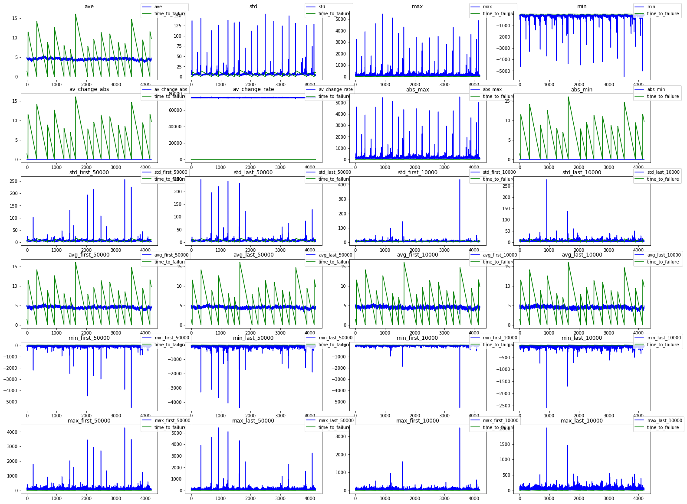
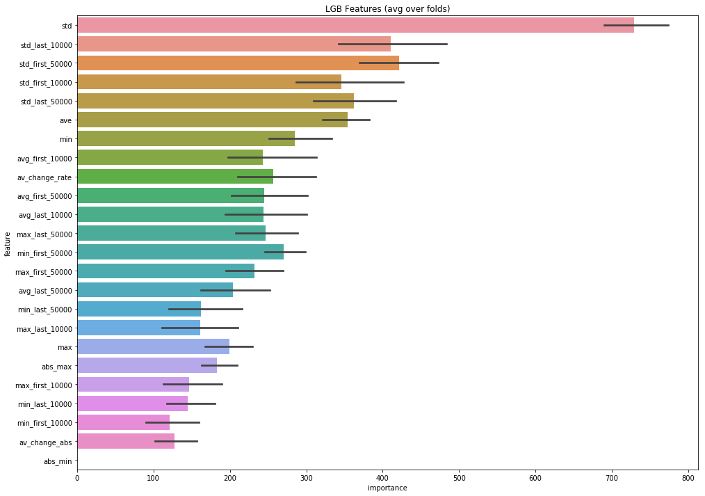
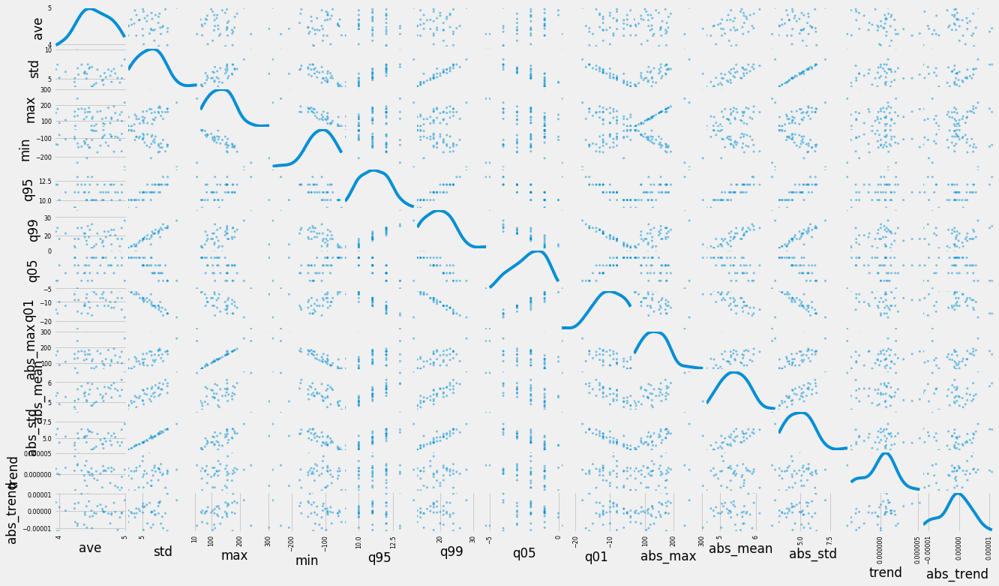
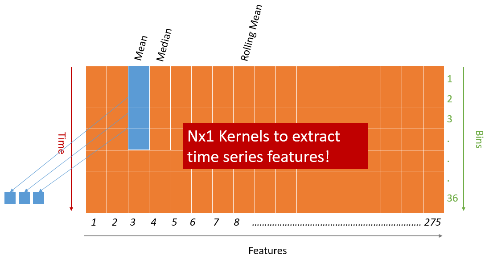
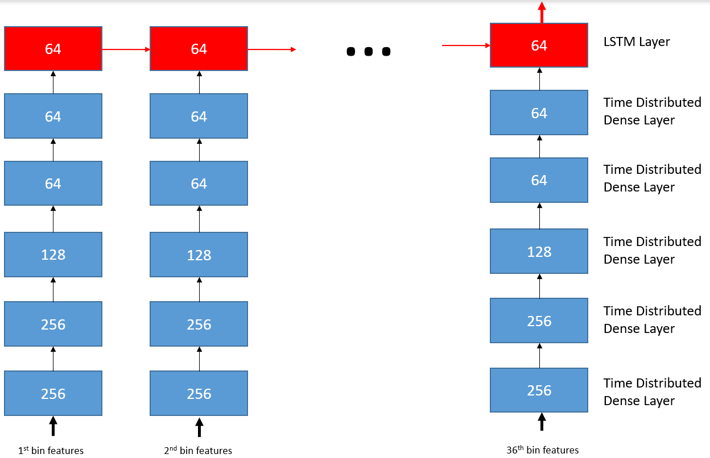
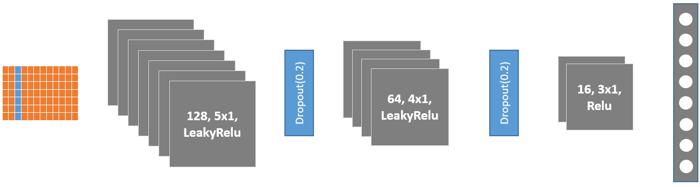
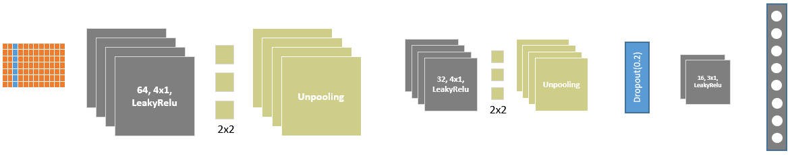
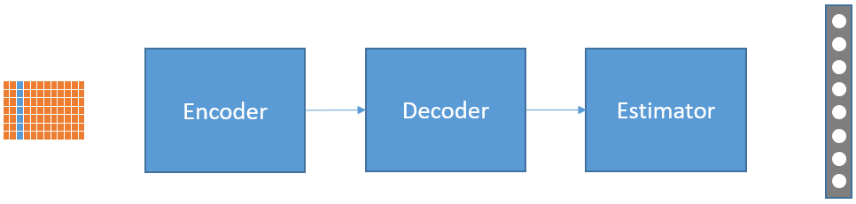
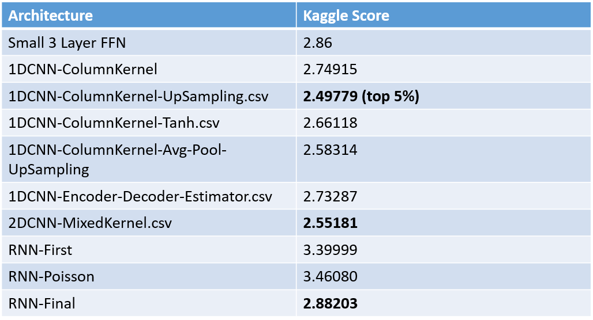

# LANL Earthquake Prediction
Kaggle Competition: [https://www.kaggle.com/c/LANL-Earthquake-Prediction/overview](https://www.kaggle.com/c/LANL-Earthquake-Prediction/overview)

# 2. Objective
Based on our observation of existing solutions and research, we decided to build a solution
with generalization as the goal rather than scoring the highest.And
in this work, we present several neural network based solutions
which generalizes well over both the training and test stages.

# 2. Dataset
The data comes from a well-known experimental setup used to
study earthquake physics. The acoustic_data input signal is used to
predict the time remaining before the next laboratory earthquake
(time_to_failure).

The data is grouped into bins:

# 3. Feature Engineering

## 3.1 Analysis

## 3.2 Pre-processing and Embedding
Steps:
- Extracting bins from training data: This is done by our
bin creator processes. We created both actual bins and absolute
bins. Absolute bins converts acoustic data to absolute
values. It requires about 16 hours to extract bins.
- Build Scalers: We also used scikit-learn to train robust
scalers from training data. This scalers were reused for test
dataset, too.
- One-Stat Embedding: One Stat Embeddings have 1-to-1
relation with bins. So, for each bin we extracted statistical
features and saved it as the embedding. It requires about a
day to create the embeddings.
- Multi-StatEmbedding: These have 1-to-many relation with
bins. In fact, for each 36 bins we create a single statistical
feature set and saved it as the embedding.It requires about a
day to create the embeddings.
- CNN-Stat Embedding: This embedding has 36 statistics for
36 consecutive bins as rows. It also have 1-to-many relation
with bins, but it does not create a single statistical feature
set. It requires about two days to create the embeddings.
- Over-sampling: To create more data for training, we used
windowing-technique.

### Why CNN Embedding:

## 3.3 Extracted Features
Total number of features we developed: 275 for CNN models, 31 for
RNN models.
1. **Statistical Measures**: We calculated 15-18 statistical features
on different transformation of the raw data. The base features are:
    - Mean
    - Median
    - Standard Deviation
    - Minimum and Maximum
    - Range
    - Different percentiles
    - Entropy
    - Kurtosis
    - Skewness
    - Correlations
    - etc.
2. **Transformations**:
    - Absolute values
    - FFT (Fast Fourier Transform)
    - Spectogram
    - Different Rolling Means [5, 10, 20, 40, 100, 1000]
    - Linear seasonality
    - First-order seasonality

# 4. Models
All our models are neural network-based.We built a big set of Fully
Forward Networks (FFNs), Recurrent Neural Networks (RNNs),
and Convolutional Neural Networks (CNNs). We list here the most
important ones only. We excluded different variations, but those
are available in our repositories.

**Loss Functions:**
- MSE
- Cosine Similarity

**Optimizers:**
- RMSProp
- Adam
- Nadam

**Evaluation Metric:**
- MAE

We have a set of models which can be found in **estimator** and **RNNCode** folders. We here illustrate a few

## 4.1 Final RNN

## 4.2 Fully CNN

## 4.3 Upsampling CNN (Best performer)

## 4.3 Encoder-Decoder-Estimator CNN (Good performer)

# 5 Kaggle Scores:

